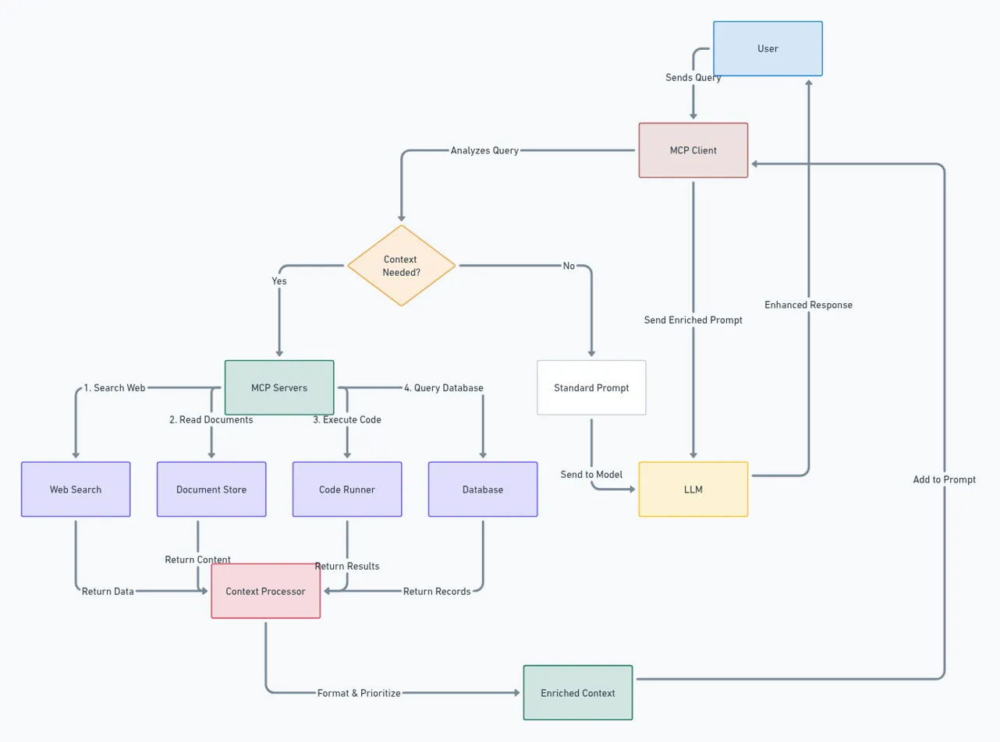

# Whimsical MCP Server
[](https://smithery.ai/server/BrockReece/whimsical-mcp-server)

A Model Context Protocol (MCP) server that enables the creation of Whimsical diagrams programmatically. This server integrates with Whimsical's API to generate diagrams from Mermaid markup.

## Demo

Here's an example of a complex system architecture diagram created using this MCP server and Claude - it shows the Model Context Protocol (MCP) architecture itself:




## Features

- Create Whimsical diagrams using Mermaid markup generated by the MCP Client (Claude, Windsurf, etc.)
- Returns both the Whimsical diagram URL and a base64 encoded image to allow the Client to iterate on it's original markup

## Installation

### Installing via Smithery

To install Whimsical MCP Server for Claude Desktop automatically via [Smithery](https://smithery.ai/server/BrockReece/whimsical-mcp-server):

```bash
npx -y @smithery/cli install BrockReece/whimsical-mcp-server --client claude
```

### Manual Installation
```bash
# Clone the repository
git clone https://github.com/BrockReece/whimsical-mcp-server.git

# Install dependencies
yarn install

# Build the project
yarn build
```

### Integration with MCP Client
Update the MCP Client's config to point to this repository's dist folder
eg:
```json
    {
        "mcpServers": {
            "whimsical": {
                "command": "node",
                "args": [
                    "/path/to/this/repo/whimsical-mcp-server/dist/index.js"
                ]
            }
        }
    }
```
## License

This project is licensed under the MIT License.
